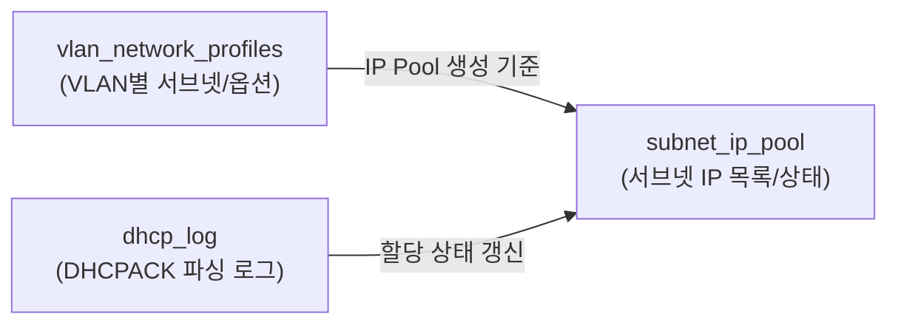

# DB Table Specification (DB 기반 주소정보 관리)

**DB를 중심으로 VLAN별 서브넷 등록**, **IP 주소 풀(IP Pool) 생성**, **IP 할당 현황 관리**를 수행한다.  
핵심 테이블은 아래 3개이며, DHCP 로그(DHCPACK 등) 기반으로 IP/MAC 매핑을 갱신하는 형태로 설계했다.

---

## 전체 흐름 (요약)

- **`vlan_network_profiles`**: VLAN별 네트워크 프로파일(서브넷/옵션) 마스터
- **`subnet_ip_pool`**: 서브넷(IP Pool) 단위 IP 목록 및 사용(할당) 현황
- **`dhcp_log`**: DHCPACK 로그에서 파싱한 IP/MAC/VLAN 이벤트 기록

---

## 1) `dhcp_log`

### 목적
DHCPACK 등 DHCP 이벤트 로그에서 파싱한 **IP/MAC/Hostname/VLAN 정보**를 저장하는 로그 테이블.  
`subnet_ip_pool` 갱신(할당 상태 업데이트)의 **원천 데이터(입력)** 로 사용한다.

### 컬럼 명세

| Description | Column | Data Type | NULL | Default | 비고 |
|---|---|---|:---:|---|---|
| 식별자 | `id` | INTEGER | X | - | **PK**, Auto Increment |
| 발생한 시점 | `log_time` | TIMESTAMP | X | `''` | 이벤트 발생 시각 |
| IP 주소 | `ip_addr` | VARCHAR(20) | X | `''` | IPv4 문자열(점 포함) |
| MAC 주소 | `mac_addr` | VARCHAR(20) | X | `''` | MAC 문자열(콜론 포함) |
| Host Name | `hostname` | VARCHAR(50) | O | `''` | 없으면 공백 가능 |
| VLAN ID | `vlan_id` | SMALLINT UNSIGNED | X | `0` | VLAN 1~4094 고려 |
| DHCP Log Message | `message` | TEXT | O | `''` | 원문(재파싱/트러블슈팅 용) |

---

## 2) `vlan_network_profiles`

### 목적
VLAN 단위로 **서브넷 정보 + DHCP 옵션(게이트웨이/DNS/NTP/임대시간 등)** 을 관리하는 “네트워크 프로파일” 마스터 테이블.  
`subnet_ip_pool` 생성(초기 IP 목록 생성)과 DHCP 설정 산출의 기준 데이터로 사용한다.

### 컬럼 명세

| Description | Column | Data Type | NULL | Default | 비고 |
|---|---|---|:---:|---|---|
| 식별자 | `id` | INTEGER | X | - | **PK**, Auto Increment |
| VLAN 이름 | `vlan_name` | VARCHAR(50) | X | `''` | 장비 설정과 정합성 위해 **영문 권장** |
| VLAN 그룹 이름 | `vlan_group_name` | VARCHAR(50) | X | `''` | 예: AUTH/GUEST/MGMT 등 |
| 네트워크 주소 | `network_addr` | VARCHAR(20) | X | `''` | 예: `192.168.10.0` |
| 서브넷 마스크 | `subnet_mask` | VARCHAR(20) | X | `''` | 예: `255.255.255.0` |
| 브로드캐스트 주소 | `broadcast_addr` | VARCHAR(20) | X | `''` | 예: `192.168.10.255` |
| 게이트웨이 주소 | `gateway_addr` | VARCHAR(20) | X | `''` | 예: `192.168.10.1` |
| 타임 오프셋 | `time_offset` | FLOAT | X | `-18000` | (레거시/옵션) |
| NTP 서버 | `ntp_server` | VARCHAR(20) | X | `''` | 옵션 |
| DNS 서버 | `dns_server` | VARCHAR(50) | X | `''` | 옵션 |
| Start IP 주소 | `start_ip_addr` | VARCHAR(20) | X | `''` | 풀 시작 주소 |
| End IP 주소 | `end_ip_addr` | VARCHAR(20) | X | `''` | 풀 끝 주소 |
| Start IP 숫자 | `start_ip_number` | INT UNSIGNED | X | `0` | INET_ATON 기반 정수 저장 |
| End IP 숫자 | `end_ip_number` | INT UNSIGNED | X | `0` | INET_ATON 기반 정수 저장 |
| 기본 임대 시간 | `default_lease_time` | INT UNSIGNED | X | `86400` | 초 단위 |
| 최대 임대 시간 | `max_lease_time` | INT UNSIGNED | X | `86400` | 초 단위 |
| IP/MAC 맵핑 상태 | `ip_mac_mapping_state` | TINYINT UNSIGNED | X | `1` | 1: 사용(적용), 0: 미사용(비활성) |
| 도메인 이름 | `domain_name` | VARCHAR(50) | X | `''` | 옵션 |

---

## 3) `subnet_ip_pool`

### 목적
서브넷 단위로 **IP 주소 목록(1 IP = 1 Row)** 을 관리하고, MAC/사용자/상태를 통해 **IP 할당 현황**을 기록한다.  
`dhcp_log`를 입력으로 받아 상태를 갱신하며, `vlan_network_profiles`의 범위 정의를 기준으로 초기 생성될 수 있다.

### 컬럼 명세

| Description | Column | Data Type | NULL | Default | 비고 |
|---|---|---|:---:|---|---|
| 식별자 | `id` | INTEGER(20) | X | - | **PK** |
| IP 주소 | `ip_addr` | VARCHAR(20) | X | `''` | IPv4 문자열 |
| MAC 주소 | `mac_addr` | VARCHAR(20) | X | `''` | 할당 시 갱신 |
| 사용자 이름 | `user_name` | VARCHAR(20) | X | `''` | 필요 시 확장(예: 50) |
| VLAN ID | `vlan_id` | SMALLINT UNSIGNED | X | `0` | VLAN 식별 |
| IP 할당 상태 | `ip_alloc_state` | VARCHAR(1) | X | `U` | 예: `U`(Unused), `A`(Administration), `L`(Leased) |
| IP Number | `ip_number` | INT UNSIGNED | X | `0` | INET_ATON 기반 정수 |

---

## 상태 코드 (ip_alloc_state)

| Code | Meaning |
|---:|---|
| `U` | Unused (미할당/미사용) |
| `A` | Administration (관리용) |
| `L` | Leased (사용 중 / 할당됨) |

---
